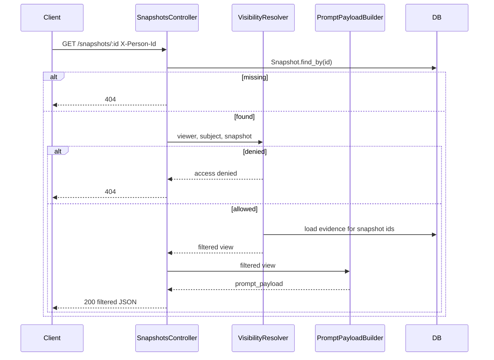

# S2 — Visibility flow

How `GET /snapshots/:id` resolves access and builds a filtered payload
before anything is serialized. See SPEC.md §6 and AGENTS.md rule 3.

```mermaid
sequenceDiagram
  participant Client
  participant SnapshotsController
  participant VisibilityResolver
  participant PromptPayloadBuilder
  participant DB

  Client->>SnapshotsController: GET /snapshots/:id X-Person-Id
  SnapshotsController->>DB: Snapshot.find_by(id)
  alt missing
    SnapshotsController-->>Client: 404
  else found
    SnapshotsController->>VisibilityResolver: viewer, subject, snapshot
    alt denied
      VisibilityResolver-->>SnapshotsController: access denied
      SnapshotsController-->>Client: 404
    else allowed
      VisibilityResolver->>DB: load evidence for snapshot ids
      VisibilityResolver-->>SnapshotsController: filtered view
      SnapshotsController->>PromptPayloadBuilder: filtered view
      PromptPayloadBuilder-->>SnapshotsController: prompt_payload
      SnapshotsController-->>Client: 200 filtered JSON
    end
  end
```
