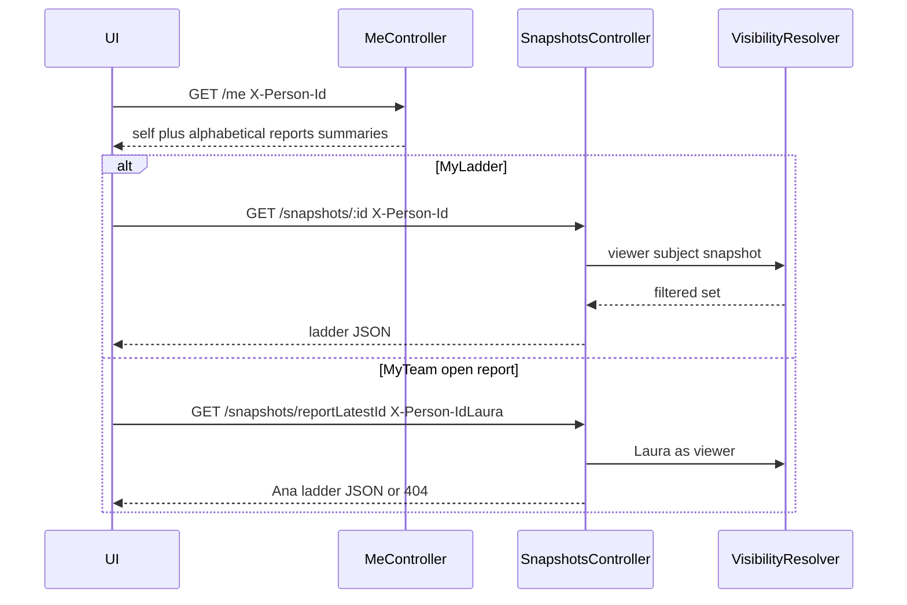

# S3 — UI data flow

How the lens bar bootstraps via `GET /me`, then loads a ladder through
`GET /snapshots/:id` with the same `X-Person-Id`. Visibility stays on the
server — React only chooses which snapshot id to request.

