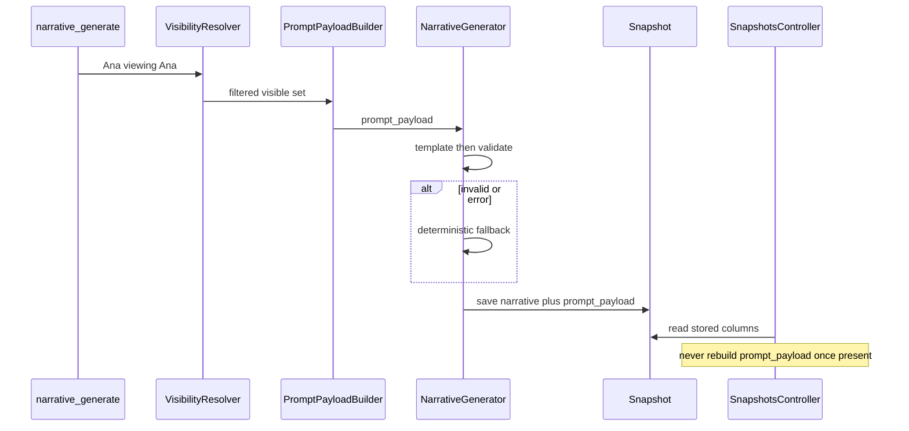

# S4 — Narrative generate → validate → persist → serve

How a deterministic narrative is built from an already-filtered payload,
validated against the SPEC §7 schema, persisted on the snapshot (D14),
and served unchanged on `GET /snapshots/:id`. No real LLM call (D15).

